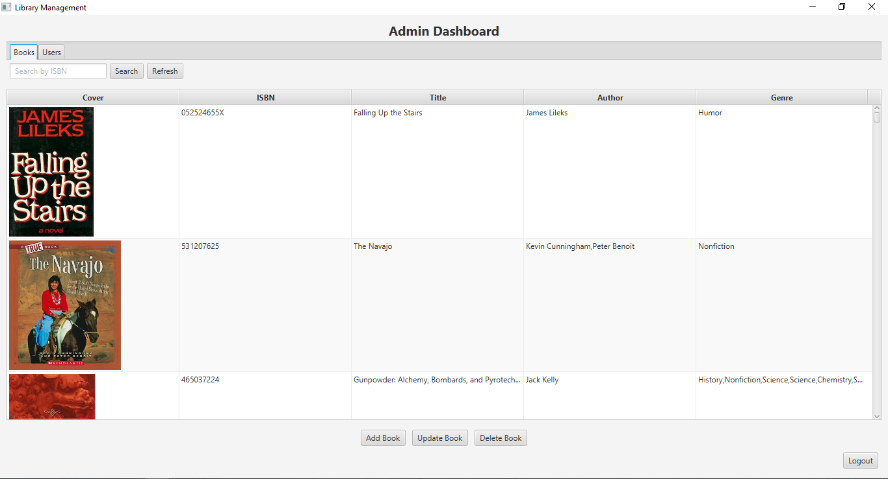

# Library Management System

Ứng dụng "Library Management System" là một hệ thống quản lý thư viện đơn giản, phát triển bằng JavaFX và JDBC. Ứng dụng cho phép:

* Quản lý sách (Book)
* Quản lý người dùng (Admin, Borrower)
* Quản lý quy trình mượn và trả sách
* Tìm kiếm và lọc sách theo tiêu chí
* Đăng nhập và phân quyền truy cập

---

## 1. Công nghệ sử dụng

* **Java 8+**
* **JavaFX 8.8.3**: Giao diện người dùng
* **JDBC**: Kết nối và thao tác với cơ sở dữ liệu MySQL
* **Maven** (hoặc Gradle): Quản lý phụ thuộc và build

---

## 2. Kiến trúc ứng dụng

1. **Entities** (POJOs): `Book`, `Person` (abstract), `Admin`, `Borrower`, `BorrowRecord`.
2. **DAO Layer** (Data Access Object):

   * Interface generic `Dao<T,K>` và các con: `BookDao`, `UserDao`, `BorrowRecordDao`.
   * Implementation: `BookDaoImpl`, `UserDaoImpl`, `BorrowRecordDaoImpl`, sử dụng `ConnectorDB` để lấy kết nối JDBC.
3. **Service Layer**:

   * `AuthService`: Đăng nhập, phân quyền.
   * `UserService`: CRUD người dùng.
   * `BookService`: CRUD và tìm kiếm sách.
   * `BorrowService`: Xử lý nghiệp vụ mượn/trả sách.
4. **UI Layer** (JavaFX Controllers):

   * `LoginScreen`: Màn hình đăng nhập, phân hướng đến dashboard phù hợp.
   * `AdminDashboard`: Quản lý sách, người dùng, mượn/trả.
   * `BorrowerDashboard`: Cho người mượn: tìm sách, mượn, xem lịch sử.
5. **Ứng dụng khởi chạy**:

   * `LibraryManagementMain` extends `Application`: tạo `Stage`, hiển thị `LoginScreen`.

---

## 3. Các chức năng chính
### 3.1. Đăng nhập & Phân quyền

* Người dùng mở ứng dụng, nhập `username` và `password`.
* `AuthService` kiểm tra thông tin và xác định vai trò:

  * **Admin**: truy cập AdminDashboard.
  * **Borrower**: truy cập BorrowerDashboard.

### 3.2. Quản lý Sách (Admin)

* **Thêm sách mới**: Nhập thông tin (tác giả, tiêu đề, ISBN, ...) và lưu vào CSDL.
* **Sửa / Xóa sách**: Cập nhật hoặc xoá bản ghi sách.
* **Tìm kiếm sách**: Theo tiêu đề hoặc tác giả.
* **Hiển thị danh sách sách**: TableView liệt kê tất cả sách.

### 3.3. Quản lý Người dùng (Admin)

* **Thêm / Sửa / Xóa người dùng**: Phân quyền Admin hoặc Borrower.
* **Xem danh sách người dùng**: TableView hiển thị các thông tin cơ bản.
* **Tìm kiếm theo vai trò**: Lọc danh sách theo `Role`.

### 3.4. Quản lý Mượn - Trả Sách

#### 3.4.1. Mượn sách

* Người dùng (`Borrower`) chọn sách và số lượng.
* `BorrowService` kiểm tra tồn kho và tạo `BorrowRecord` mới.
* Cập nhật số lượng sách đang mượn trong `Borrower.borrowed` và cơ sở dữ liệu.

#### 3.4.2. Trả sách

* Borrower chọn bản ghi mượn chưa trả.
* `BorrowService` cập nhật `returnDate` và giảm giá trị trong map `borrowed`.

#### 3.4.3. Xem lịch sử mượn

* **BorrowerDashboard** hiển thị danh sách `BorrowRecord` (đang mượn và đã trả).
* **AdminDashboard** có thể xem các bản ghi của bất kỳ người dùng nào.

---

## 4. Người dùng (User Roles)

1. **Admin**

   * Vai trò: Quản trị viên hệ thống.
   * Quyền hạn:

     * Toàn quyền CRUD sách và người dùng.

2. **Borrower**

   * Vai trò: Người mượn sách.
   * Quyền hạn:

     * Xem danh sách các sách có sẵn.
     * Tìm kiếm sách theo tiêu đề/tác giả.
     * Mượn và trả sách theo mã IBSN.
     * Xem lịch sử mượn cá nhân.

---

## 5. Cài đặt & Chạy ứng dụng

1. **Thiết lập CSDL**:
   * Sử dụng cơ sở dữ liệu sách [GoodRead 100k quyển](https://www.kaggle.com/datasets/mdhamani/goodreads-books-100k)
   * Tạo database MySQL, import cấu trúc bảng theo file `Database schema.txt`.
   * Cấu hình kết nối trong `ConnectorDB.java` (URL, user, password).
2. **Build & Run**:

   ```bash
   mvn clean install
   mvn javafx:run
   ```

   hoặc chạy trực tiếp `LibraryManagementMain` trong IDE.

---

## 6. Unit Tests

Dự án bao gồm hai lớp kiểm thử chính nằm trong thư mục `src/test/java`:

### 6.1. `BookServiceTest.java`

* **Mục đích**: Xác nhận các phương thức trong `BookService` hoạt động đúng.
* **Các Test Case chính**:

*  6.1.1. **testAddBookSuccess**: Kiểm tra khi thêm một `Book` hợp lệ, gọi `BookDao.save()` được thực thi và trả về `true`.
*  6.1.2. **testFindByTitle**: Tìm kiếm sách theo tiêu đề đã thêm trước đó và xác nhận kết quả đúng.
*  6.1.3. **testUpdateBook**: Cập nhật thông tin sách (ví dụ: số trang, rating) và đảm bảo `BookDao.update()` trả về `true`.
*  6.1.4. **testDeleteBook**: Xóa sách theo `id` và xác minh `BookDao.delete()` trả về `true`.

### 6.2. `BorrowServiceTest.java`

* **Mục đích**: Đảm bảo logic nghiệp vụ mượn/trả sách trong `BorrowService` vận hành chính xác.
* **Các Test Case chính**:

*  6.2.1. **testBorrowBookSuccess**: Khi sách còn đủ tồn kho, tạo `BorrowRecord` mới và cập nhật map `borrowed` trong `Borrower`.
*  6.2.2. **testBorrowBookOutOfStock**: Khi số lượng yêu cầu vượt quá tồn kho, ném exception hoặc trả về `false` tuỳ thiết kế.
*  6.2.3. **testReturnBookSuccess**: Cập nhật `returnDate` cho bản ghi và giảm đúng số lượng trong `borrowed`.
*  6.2.4. **testGetUnreturnedRecords**: Lấy danh sách bản ghi chưa trả của một `Borrower` và so sánh với dữ liệu mẫu.

